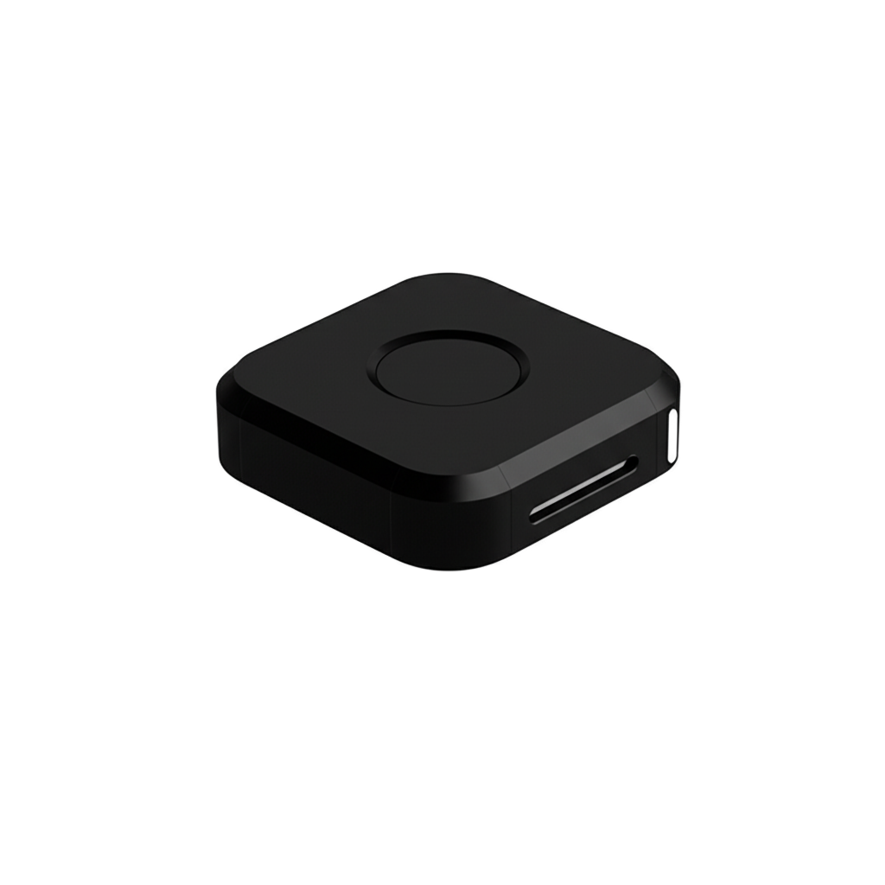

# immurok

<p align="center">
  
</p>

**Wireless fingerprint authenticator for Mac and Linux.**

immurok is an open-source hardware security key with a built-in fingerprint sensor. It brings biometric authentication to every Mac and Linux machine — desktops, clamshell laptops, and headless servers — over Bluetooth LE.

**One touch to unlock your screen, authorize sudo, sign SSH commits, and more.**

## Features

- **Screen unlock** — Touch to unlock macOS lock screen and Linux login
- **sudo / polkit** — Fingerprint replaces password for privilege escalation
- **SSH agent** — On-device ECDSA key generation and signing (private key never leaves the device)
- **TOTP** — Hardware-backed one-time password generation with Quick Fill (`Ctrl+\`)
- **API key vault** — Encrypted credential storage with biometric access
- **Mutual authentication** — ECDH P-256 pairing + HMAC-SHA256 signed notifications
- **Open source** — Firmware, drivers, and companion apps are fully open

## How It Works

```
┌──────────────────────┐     BLE      ┌──────────────────┐
│  Companion App       │◄────────────►│  immurok Device  │
│  (macOS / Linux)     │   Custom     │  CH592F + ZW3021 │
│                      │   GATT       │                  │
│  - BLE manager       │              │  - BLE HID       │
│  - PAM socket server │              │  - Fingerprint   │
│  - SSH agent         │              │  - Key storage   │
│  - Screen unlocker   │              │  - ECDH / HMAC   │
└──────────┬───────────┘              └──────────────────┘
           │
    ┌──────▼──────┐
    │ PAM module  │
    │ pam_immurok │
    └─────────────┘
```

1. The device pairs with the companion app via ECDH P-256 key exchange.
2. When you touch the fingerprint sensor, the device sends an HMAC-signed notification over BLE.
3. The companion app verifies the signature and performs the requested action: type a password, respond to a PAM challenge, or sign an SSH request.

## Repository Structure

```
firmware/              CH592F main firmware (C, Makefile)
ota/
  jumpapp/             OTA JumpIAP bootloader (4 KB)
  iap/                 OTA IAP bootloader (12 KB)
app-macos/             macOS companion app (Swift, SwiftPM)
  pam/                 macOS PAM module (C, Makefile)
app-linux/             Linux companion daemon + GUI (Python)
hardware/              Schematics, PCB layout, component selection
docs/
  protocol.md          BLE communication protocol
  security.md          Security architecture whitepaper
```

## Hardware

| Component | Part | Notes |
|-----------|------|-------|
| MCU | WCH CH592F | RISC-V, BLE 5.4, 448 KB flash |
| Fingerprint sensor | ZW3021 | Capacitive, 508 DPI, < 500 ms match, 29 templates |
| Connection | Bluetooth LE | HID keyboard + custom GATT |
| Power | USB-C | Bus-powered |

See [hardware/README.md](hardware/README.md) for detailed component selection rationale, GPIO pinout, and wiring diagram.

## Quick Start

### Prerequisites

- **Firmware**: [WCH CH592F SDK](http://www.wch-ic.com/) in `firmware/SDK/` (not included)
- **Flash tool**: [`wlink`](https://github.com/ch32-rs/wlink) (`cargo install --git https://github.com/ch32-rs/wlink`)
- **OTA keys**: `pip3 install cryptography && python3 ota/generate_ota_keys.py`
- **macOS app**: Xcode Command Line Tools, Swift 5.7+, macOS 13+
- **Linux app**: Python 3.8+, BlueZ, D-Bus

### Build

```bash
# Firmware — compile + OTA package + flash
ota/upload-ota.sh release

# macOS app — compile + sign + deploy
app-macos/build-deploy.sh

# macOS PAM module
cd app-macos/pam && make
sudo cp pam_immurok.so /usr/lib/pam/

# Linux
cd app-linux && make && sudo make install
```

### First Run (macOS)

1. Open `/Applications/immurok.app`.
2. Grant Accessibility permission when prompted.
3. Open settings from the menu bar icon.
4. Pair with your immurok device.
5. Enroll at least one fingerprint.
6. Set your Mac login password (stored in Keychain, never sent over BLE).
7. Lock the screen, touch the sensor — done.

## On-Device Key Storage

The device stores cryptographic keys in CH592F flash. Private keys never leave the device.

| Category | Max Keys | Description |
|----------|----------|-------------|
| SSH | 32 | ECDSA P-256 keypairs, on-device signing |
| TOTP | 128 | HMAC-based one-time passwords |
| API | 50 | Credential strings, biometric-gated read |

## OTA Firmware Update

```bash
python3 ota/ota-update.py firmware/build/immurok_CH592F.imfw
```

OTA images are encrypted (AES-128-CTR) and signed (HMAC-SHA256). Keys are generated per development machine and not committed to the repository. See [ota/README.md](ota/README.md) for partition layout and update flow.

## Documentation

| Document | Description |
|----------|-------------|
| [docs/protocol.md](docs/protocol.md) | BLE GATT protocol — commands, notifications, packet formats, connection parameters |
| [docs/security.md](docs/security.md) | Security architecture — ECDH pairing, HMAC signing, PAM integration, threat model |
| [hardware/README.md](hardware/README.md) | Hardware design — component selection, GPIO pinout, wiring diagram |
| [ota/README.md](ota/README.md) | OTA update — flash layout, boot sequence, .imfw package format |
| [app-macos/README.md](app-macos/README.md) | macOS app — build instructions, architecture, source file guide |

## Security

immurok uses defense-in-depth:

- **ECDH P-256** pairing with ephemeral keys and private key erasure
- **HKDF-SHA256** key derivation (RFC 5869)
- **HMAC-SHA256** signed fingerprint notifications (8-byte truncated tag)
- **On-device key storage** — SSH private keys and TOTP secrets never leave the device
- **Fingerprint gating** — Sensitive operations (key signing, deletion, factory reset) require biometric proof with 10-second cooldown
- **PAM peer verification** — Unix socket accepts only root or current user (`getpeereid`)
- **OTA encryption** — AES-128-CTR + HMAC-SHA256 signed firmware images

Passwords are stored in macOS Keychain and never transmitted over BLE.

See [docs/security.md](docs/security.md) for the full security whitepaper.

## License

This project is licensed under the [Business Source License 1.1](LICENSE).

- **Permitted**: personal use, education, non-commercial research
- **Not permitted**: commercial use (until the Change Date)
- **Change Date**: 2030-03-05 — automatically converts to **Apache License 2.0**
